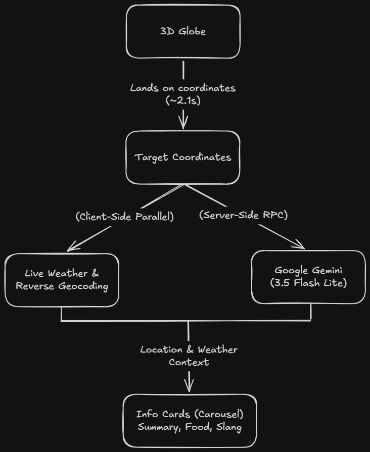

# 🌍 Orbis — Random World Facts on a 3D Globe

Orbis is a web app built by [Yash Chavan](https://www.linkedin.com/in/yash-chavan/) that lets you spin a 3D Earth, land on a random spot, and explore live weather alongside local facts.

I built this project to get hands-on experience orchestrating multiple third-party APIs and using an LLM to generate structured context on the fly. 

Prototyped and built using Lovable, with the system architecture, multi-API pipelines, and LLM prompt logic designed and implemented by me.

---

## 🎯 Why I Built This

As a Product Manager, I wanted to go beyond high-level PRDs and actually build a project that handles real-time data orchestration and LLM integrations. 

My main goals were to:
* **Manage Multi-API Pipelines:** Fetch live weather, geocoding, and map graphics in parallel without making the UI feel sluggish.
* **Work with Structured LLM Outputs:** Prompt an AI model to take dynamic context (city name, current weather, time of day) and return strict JSON to populate fixed UI cards.
* **Handle Edge Cases Gracefully:** Design fallback mechanisms for missing data, API failures, ocean/wilderness landings, and obscure towns.

---

## 🏗️ How It Works & Architecture

1. **Target Selection:** Tapping "Find a Destination" picks a random land coordinate from a curated list of 30 global locations, animates the globe camera, and triggers data fetching once settled.
2. **Live Data Fetching (Client):** 
   * Fetches real-time temperature, weather codes, and time offsets from **Open-Meteo**.
   * Converts lat/long coordinates into a city and country using **BigDataCloud**, falling back to **Nominatim (OpenStreetMap)** if BigDataCloud rate limits.
   * If you land in the middle of nowhere (ocean or uninhabited land), local logic calculates the biome based on latitude (Polar, Taiga, Desert, Tropical, etc.) to trigger relevant generic copy.
3. **AI Fact Generation (Server):** 
   * Sends location and weather data to **Google Gemini 3.5 Flash Lite** via a TanStack server function (so the API key stays hidden from the browser).
   * Gemini returns a strictly validated JSON payload (`vibeSummary`, `bizarreFact`, `localFood`, `localSlang`) in a casual, witty tone.
   * If Gemini fails or returns an empty key, a local backup engine picks from a 5-item randomized fallback pool per category so the user never sees a broken card.

---

## 🛠️ Tech Stack

* **AI Builder:** Lovable
* **Frontend Framework:** React 19, TanStack Start v1 (Vite, SSR, Server Functions)
* **3D Globe:** `react-globe.gl`, `three-globe`, Three.js
* **AI Model:** Google Gemini API (`gemini-3.5-flash-lite`)
* **APIs & Services:** Open-Meteo (Weather), BigDataCloud & Nominatim (Geocoding), FlagCDN (Country flags)
* **Styling & Validation:** Tailwind CSS v4, Zod schema validation

---

## 💡 Security, Latency & Reliability

* **Server Functions for Security:** Kept the Gemini API key completely server-side on Vercel using TanStack server functions (`createServerFn`) rather than calling Gemini directly from the client.
* **Cost vs. Latency for LLMs:** Used `gemini-3.5-flash-lite` because it is fast enough to keep the UI snappy while costing fractions of a cent per request.
* **Designing for API Resilience:** Free geocoding APIs frequently throw rate-limit errors (402/403). Adding a primary-to-fallback geocoding pipeline and local fallback copy ensured the app never crashes or displays empty states.
